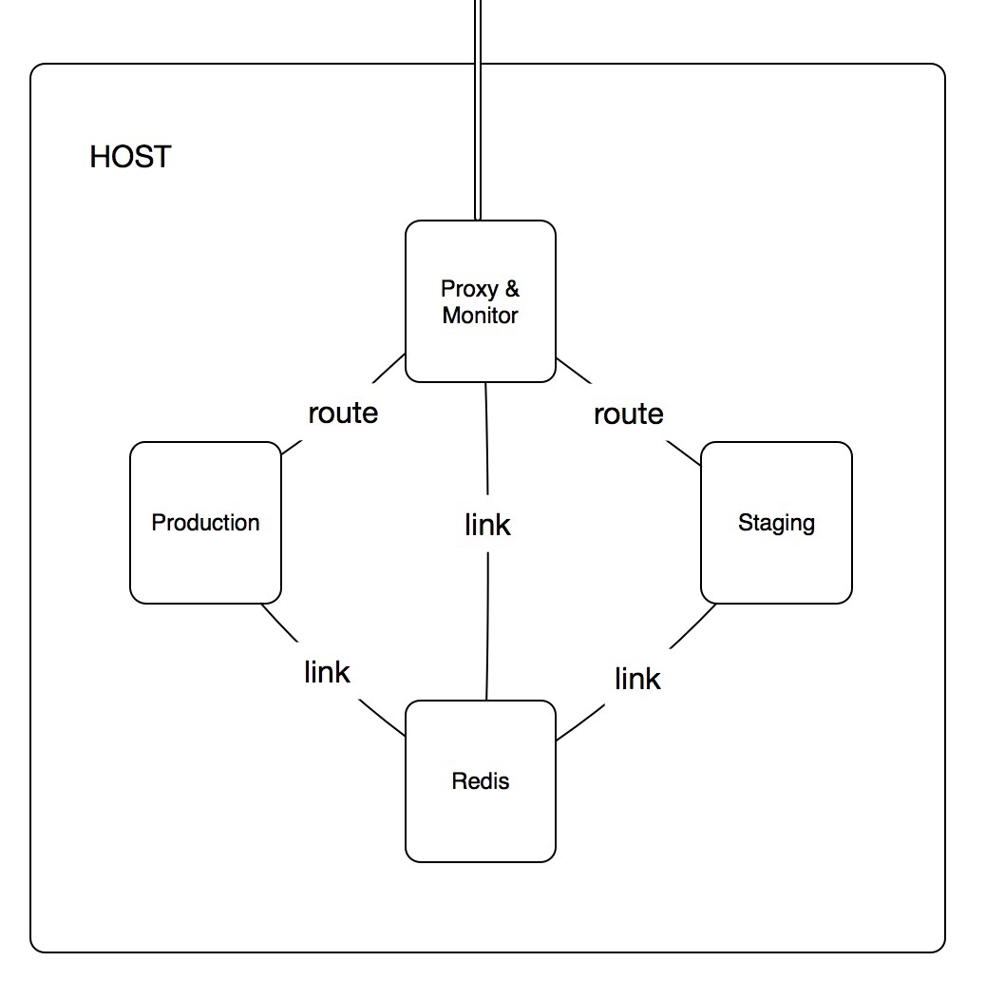
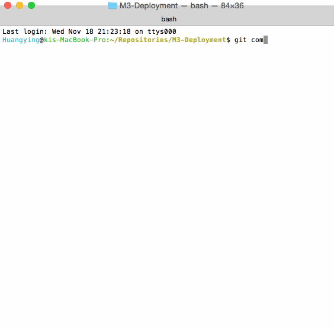
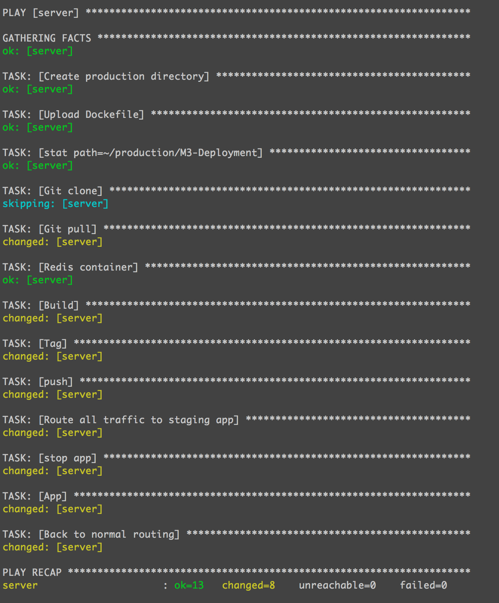
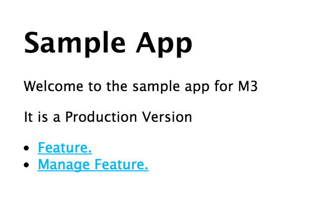
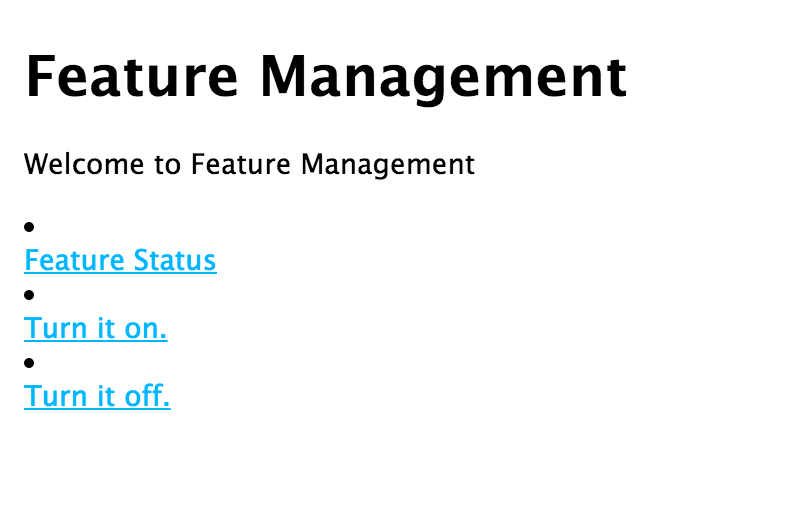
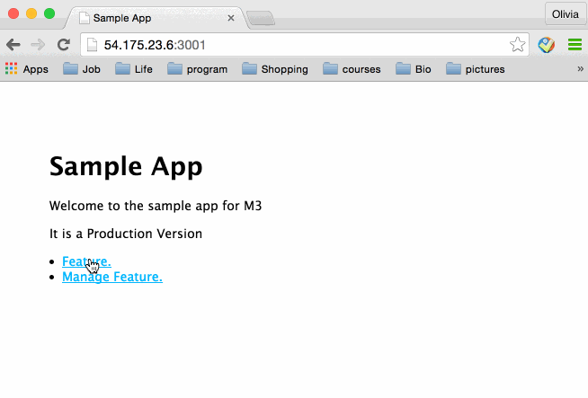
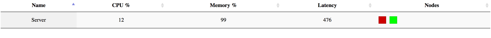

# M3-Deployment

### Structure:




### URL: 
[Proxy](http://54.175.23.6:3000)   
[Production](http://54.175.23.6:3001)    
[Staging](http://54.175.23.6:3002)   
[Monitor](http://54.175.23.6:8080)

###Configuration and deployment:
####1. Automatic configuration:
We use the technics from [HW1](https://github.com/DevOpsHW/DevOps-HW1) to launch a AWS instance, create the `inventory` file, and then use an 
ansible playbook `provision.yml` to do the automatic configuration, including install Git, curl, Docker, pip, docker-py:     

    ansible-playbook -i inventory deployment/provision.yml

It will configure the server to be ready for deploying.

####2.Test and analysis:
Extending from [milestone2](https://github.com/DevOpsGHZ/M2-Test_Analysis), we use  mocha and supertest module to do unit test and Jshint to do analysis. Unit tests are writen in /src/test/test.js. Test and analysis shell script is writen in pre-commit.sh.



####3. Deployment:
We deploy our app by using Docker, in total we use 4 containers, one for the production app, one for 
the staging app, one for the proxy/monitor and the last one for the Redis server. 

If we want to deploy the production app, we can use command  
    
    ansible-playbook -i inventory deployment/production.yml
 
Basically, in the `production.yml` playbook it will do:
* Upload the Dockerfile to create the image for sample app


```
    - name: Create production directory
      file: state=directory path=~/production

    - name: Upload Dockefile
      copy: src=prod-Dockerfile dest=~/production/Dockerfile
```   
* Clone/pull the repository that has the sample app and keep it up-to-date:

```
    - stat: path=~/production/M3-Deployment
      register: repo_exist
    
    - name: Git clone
      command: git clone https://github.com/DevOpsGHZ/M3-Deployment
      when: repo_exist.stat.exists == False
      args:
        chdir: ~/production

    - name: Git pull
      command: git pull
      when: repo_exist.stat.exists == True
      args:
        chdir: ~/production/M3-Deployment
```

* Run Redis container from Redis image

```    
       - name: Redis container
      docker:
        name: myredis
        image: redis
        command: redis-server --appendonly yes
        state: started
        expose:
          - 6379
        docker_api_version: 1.18
      sudo: yes
```

* Build image then run the container for the sample app

```
    - name: Build
      command: docker build -t sample-app .
      args:
        chdir: /home/ubuntu/production
      sudo: yes
      

```

* Give the image a tag call 'production'


```

    - name: Tag
      command: docker tag -f sample-app localhost:5000/sample:production
      sudo: yes
   
    - name: push
      command: docker push localhost:5000/sample:production
      sudo: yes

```

* Restart app
  
```

    - name: stop app
      command: docker rm -f app
      sudo: yes
      ignore_errors: yes

    - name: App
      docker:
        name: app
        image: localhost:5000/sample:production
        registry: localhost:5000
        state: restarted
        pull: always
        links:
          - "myredis:redis"
        ports:
          - 3001:3000
        docker_api_version: 1.18
      sudo: yes

```


The playbook `staging.yml` is for deploy staging app, it will clone/pull code from the `dev` branch.
 And `proxy.yml` is for deploy the proxy/monitor app. The proxy app will be deployed in a separate container, and it will reach to other apps by defining `links`. The connections between apps and Redis server are also achieved in this way.
 ```
 links:
          - "myredis:redis"
          - "app:production"
          - "staging-app:staging"
 ```


When build the app image, we use a Dockerfile like this:

```
FROM ubuntu:14.04
MAINTAINER Kelei Gong, kgong@ncsu.edu

RUN apt-get update
RUN apt-get -y install git
RUN apt-get -y install nodejs
RUN apt-get -y install npm
COPY ./M3-Deployment/src /src
RUN cd /src; npm install
EXPOSE 3000
WORKDIR /src
CMD ["nodejs", "app.js"]
```

For each app we have a different Dockerfile, to complete some specified build tasks based on the different situations. Like in the Dockerfile for proxy app, we use another verison of Node, as the `heartbeat` seems not working in the latest Node version.

```
FROM ubuntu:14.04
MAINTAINER Kelei Gong, kgong@ncsu.edu

RUN apt-get update
RUN apt-get -y install git
RUN apt-get -y install nodejs
RUN apt-get -y install nodejs-legacy
RUN apt-get -y install npm
RUN apt-get -y install wget
COPY ./M3-Deployment/src /src
RUN npm install n -g
RUN n 0.10.33
RUN cd /src; npm install
RUN npm install http-server -g
EXPOSE 3000
EXPOSE 8080
WORKDIR /src
CMD ["node", "proxy.js"]
```

###Feature Flags

####1. UI guide

We used a subpage call 'Feature' to mock certain feature in an web application:

     

After clicking 'Manage Feature', you'll able to turn the feature on or off:

      
The 'Feature' page will appear differently according to its status.
####2. Implementation
We set a key in redis call 'featureFlag' and use it to control the feature by giving it value as 'on' and 'off':

```
app.get('/fon',function(req,res){
  client.set("featureFlag", "on");
  res.render('statuson', { title: 'Status' });
  res.end();
});
app.get('/foff',function(req,res){
  client.set("featureFlag", "off");
  res.render('statusoff', { title: 'Status' });
  res.end();
});

```

Then the application will choose to present the feature by checking featureFlag's value:

```

app.get('/feature',function(req,res){
  client.get("featureFlag",function(err, reply) {
    // reply is null when the key is missing
    //console.log("Hello");
    if(reply == null)
    {
      res.render('statusunknown', { title: 'Status' });
      res.end(); 
    }
    else if (reply=='on')
    {
      res.render('feature', { title: 'Feature' });
      res.end(); 
    }
    else
    {
      res.render('unavailable', { title: 'Not available' });
      res.end();
    }

    });
});

```
####3. Demo



 
###Metrics and alerts:
To monitor the server, three metrics are used: CPU, Mem and Latency.

Using the script `siege -b -t60s http://localhost:3001`, we are able to create a high latency.



For convenience, the monitor program is merged into the proxy program so they share the port 3000. The corresponding html report is live on port 8080.

We have two servers, namely staging server and production server. Initially, the proxy will route 80% traffic to production server, 20% to staging server.

If any of the below hehaviors are detected on a server:

* cpu > 50%
* mem > 90%
* latency > 400ms

The proxy will route all the traffic to another stable server and send an email to notify the developer. The email fucntion is implement using package [nodemailer](https://github.com/andris9/Nodemailer), the receiver is set up after `to:`

```
function sendMail()
{
    var transporter = nodemailer.createTransport();
    transporter.sendMail({
    from: 'automail@DevOpsGHZ.com',
    to: 'kgong@ncsu.edu',
    subject: 'abnomal behavior on sever',
    text: 'abnomal behavior on sever'
    });
}

```

When we are deplyoing to the production server, all the traffic will be routed to staging server. After that 80% of the traffic will be routed to production server.

###Canary releasing:
To perform canary release, we use three port to mock different servers. Port 3000 for proxy, 3001 for production and 3002 for staging server. 
    
With the probablity of 80%, the proxy server will route traffic to production server, and 20% to the staging server. If alert arise, the proxy will stop routing.

Relavent code in proxy.js:

```
var instance1 = 'http://' + process.env.PRODUCTION_PORT_3000_TCP_ADDR + ':' + process.env.PRODUCTION_PORT_3000_TCP_PORT;
 var instance2 = 'http://' + process.env.STAGING_PORT_3000_TCP_ADDR + ':' + process.env.STAGING_PORT_3000_TCP_PORT;


var server  = http.createServer(function(req, res)
{
     client.get("route",function(err, reply) {
        if(reply == 0 || reply == null)
        {
          proxy.web( req, res, {target: instance1 } );  
        }
        else
        {
          var p = Math.random();
          if( p < 0.7) {
            proxy.web( req, res, {target: instance1 } );  
          }
          else
          {
            proxy.web( req, res, {target: instance2 } );   
          }
        }
});

```

